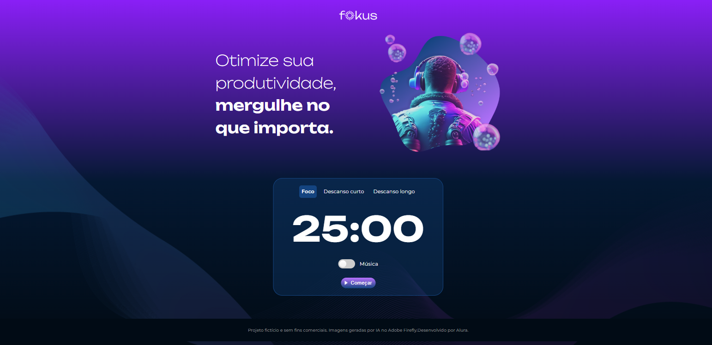

# Fokus - Pomodoro Timer 🍅

Este projeto foi desenvolvido como parte do curso de **JavaScript e manipulação do DOM** da [Alura](https://www.alura.com.br/). O objetivo principal do projeto é aprofundar os conhecimentos na manipulação de elementos da página (DOM) usando JavaScript vanilla.
[Acesse o projeto online aqui](https://lidiavidal.github.io/fokus-pomodoroTimer/)

## 📝 Sobre o Projeto

O **Fokus** é um temporizador baseado na técnica Pomodoro, que ajuda a gerenciar o tempo de trabalho e intervalos para aumentar a produtividade. O aplicativo permite alternar entre os modos de "Foco", "Descanso Curto" e "Descanso Longo".

Durante o desenvolvimento deste projeto, o foco foi exclusivamente na **manipulação do DOM**, alterando dinamicamente estilos, imagens, textos e tocando elementos de áudio através de eventos acionados pelo usuário.

## ✨ Funcionalidades

*   **Temporizador Pomodoro:** Contagem regressiva para diferentes ciclos.
*   **Modo Foco:** Temporizador para o período de concentração.
*   **Modo Descanso Curto:** Temporizador para pausas breves.
*   **Modo Descanso Longo:** Temporizador para pausas maiores.
*   **Feedback Visual:** A interface se adapta (mudança de cores de fundo e imagens) de acordo com o contexto atual (Foco, Descanso Curto ou Longo).
*   **Feedback Sonoro:** Reprodução de sons ao iniciar/pausar o temporizador e uma música de fundo opcional para ajudar na concentração.

## 🛠️ Tecnologias Utilizadas

*   **HTML5:** Estruturação semântica da página.
*   **CSS3:** Estilização do layout.
*   **JavaScript:** Lógica do aplicativo e **Manipulação intensa do DOM** (adicionar/remover classes, alterar atributos, criação de eventos).

## 🚀 Como Executar o Projeto

1. Faça o clone deste repositório ou baixe o código-fonte.
2. Abra a pasta do projeto no seu explorador de arquivos.
3. Dê um duplo clique no arquivo `index.html` para abri-lo diretamente no seu navegador web de preferência.
4. Nenhuma instalação ou servidor local é estritamente necessário, mas você pode usar a extensão "Live Server" do VS Code para uma melhor experiência.

## 🧠 O que foi aprendido

*   Uso de `querySelector` e `querySelectorAll` para selecionar elementos HTML.
*   Manipulação de classes com `classList.add()`, `classList.remove()` e `classList.toggle()`.
*   Alteração de atributos HTML como `setAttribute()`.
*   Manipulação de objetos `Audio` no JavaScript para tocar sons.
*   Uso de `setInterval` e `clearInterval` para criar a lógica de contagem regressiva.
*   Criação de escutadores de eventos (`addEventListener`).

---
*Projeto desenvolvido para fins de estudo durante o curso da Alura.*
